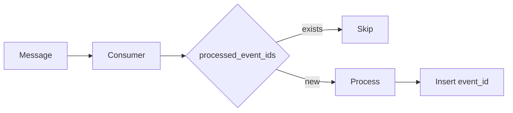

# Enterprise Integration Patterns — EIP Summary

Two patterns from Hohpe & Woolf (2003) that are directly relevant to our system's reliability design.

## Dead Letter Channel

When a consumer receives a message it cannot process, the message becomes invisible in the queue during processing. If processing fails and retries are exhausted (configured limit), the message is moved to a Dead Letter Queue (DLQ) instead of being discarded.

The DLQ is a safety net — nothing processes it automatically. It exists for inspection, alerting, manual replay once the bug is fixed, or discarding if the message is invalid. The key guarantee is that no message is lost.

**In our system:** RabbitMQ DLX (Dead Letter Exchange) routes failed messages to a DLQ after 3 retry attempts with exponential backoff (1s/2s/4s). We can inspect and replay from the DLQ.

## Idempotent Receiver

A receiver is idempotent if processing the same message multiple times produces the same result as processing it once. This matters because message queues can deliver duplicates — due to retries, network issues, or broker restarts.

EIP identifies two approaches: message deduplication, and defining message semantics to naturally support idempotency.

**In our system:** Each consumer checks a `processed_event_ids` table before processing. If the event ID already exists, the message is skipped. This implements deduplication at the application level.

